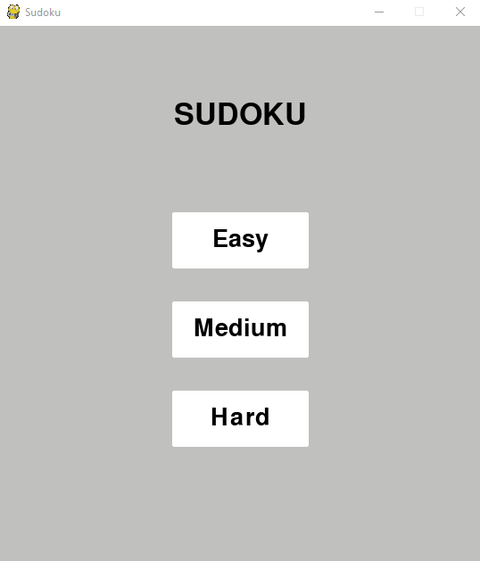

# sudoku-solver
The sudoku solver is a program that solves sudoku boards. The program uses a backtracking algorithm to solve the sudoku board. A GUI is also included in the sudoku-solver program where the user can play a game of sudoku at three different difficulty. As the user solves the sudoku board, the GUI will display the game time and number of mistakes made. Lastly, pressing the space bar will automatically solve the sudoku board with a visualization of the backtracking algorithm.  

# Backtracking Algorithm
A sudoku board starts with boxes that are either empty or prefilled with numbers. A valid numbers is classified as a number that does not break any of the three rules listed below. The backtracking algorithms will look for an empty box and use the first valid number to fill the box. Then, the same will be done for the next empty box, but there will be less options since one the numbers from 1-9 is already being used in the previous box. The backtracking algorithm will continue to fill in empty boxes with valid numbers until the rules are broken. If the rules are broken, the algorithm will go back to a previous box and try a different valid number and continues to fill in the next empty boxes. This process of filling empty boxes and visiting previous boxes continues until the board is solved.  

# Rules of Sudoku
The sudoku board consists of 9 columns and 9 rows forming a 9x9 grid of cubes. Within the grid, there are nine 3x3 subsquares.
1) Each number from 1-9 can only be used once in each row.
2) Each number from 1-9 can only be used once in each column.
3) Each number from 1-9 can only be used once in each 3x3 subsquare

The player must strategically place numbers into each box on the board while meeting these constraints. The board is complete when the player sucuessfully fills out each empty box and fulfills the three conditions. The game keeps track of the number of mistakes the player makes. Upon making three mistakes, the user will lose. 
